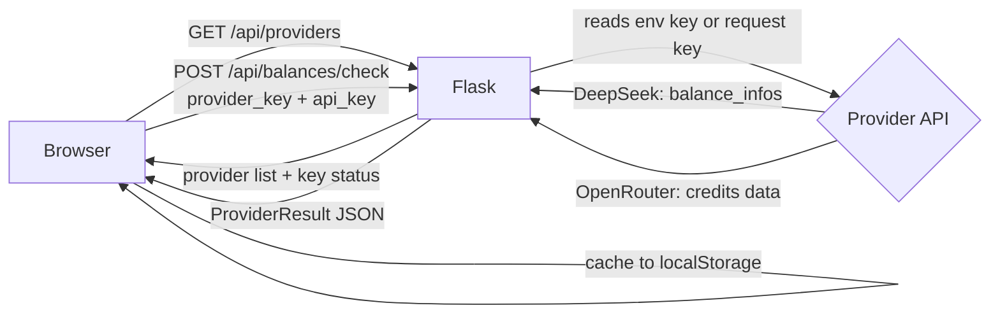

<div align="center">

# LLM Credit Counter

**Track your LLM API credits across providers in one clean dashboard.**

[](https://www.python.org/)
[](https://flask.palletsprojects.com/)
[](https://react.dev/)
[](https://vitejs.dev/)
[](https://platform.deepseek.com/)
[](https://openrouter.ai/)
[](LICENSE)

</div>

---

## What is LLM Credit Counter?

LLM Credit Counter is a self-hosted full-stack dashboard for monitoring the remaining credit balance on your LLM provider accounts - DeepSeek and OpenRouter - without logging into each provider's website. A Flask backend proxies balance requests so API keys stay server-side when configured, and a React frontend shows animated balance numbers, color-coded alerts, and a toggleable 30-second auto-refresh loop.

Key capabilities:

- Check live balances for DeepSeek and OpenRouter with one click
- Configure keys server-side via `.env` so the browser never handles them directly
- Per-session browser key override for any provider
- Color-coded balance alerts (green / amber / red) with animated sliding numbers
- Auto-refresh every 30 seconds, paused when the tab is hidden
- Result cache persisted in `localStorage` so the last known balance survives a page reload

---

## How it works

### Architecture

```
+---------------------------+
|     Browser (React/Vite)  |
|  - Provider selector      |
|  - Balance display        |
|  - API key input (opt.)   |
+------------+--------------+
             |
             | HTTP (JSON)
             |
+------------v--------------+
|    Flask Backend (Python)  |
|  - /api/providers          |
|  - /api/balances/check     |
|  - Serves frontend dist    |
+----+------------------+---+
     |                  |
     | Bearer token      | Bearer token
     v                  v
+---------+       +------------+
| DeepSeek|       | OpenRouter |
|   API   |       |    API     |
+---------+       +------------+
```

### Request pipeline



### Balance color thresholds

| Range | Color | Status |
|---|---|---|
| `balance >= $5.00` | Green | Healthy |
| `$1.00 <= balance < $5.00` | Amber | Low - top up soon |
| `balance < $1.00` | Red | Critical - nearly exhausted |

### Hard rules

- An API key sent from the browser is forwarded only to the specific provider endpoint for that single request and is never stored server-side.
- When a server-side environment key is configured for a provider, the browser input field is hidden unless the user explicitly opens "Use my own API key instead."
- Auto-refresh fires only when `document.visibilityState !== "hidden"` and skips if a check is already in flight.
- Balances are rounded to two decimal places before being returned to the client.

---

## Setup

### Prerequisites

- Python 3.10+
- Node.js 18+
- API keys for any providers you want to monitor (or paste them in the browser per session)

### Install

```bash
# Clone the repository
git clone https://github.com/sudo-Harshk/credit-counter.git
cd credit-counter

# Backend dependencies
cd backend
python -m venv venv
source venv/bin/activate        # Windows: venv\Scripts\activate
pip install -r requirements.txt

# Frontend dependencies
cd ../frontend
npm install
```

### Configure

Create `backend/.env` with your provider keys (all optional - any omitted key will be requested in the browser):

```env
DEEPSEEK_API_KEY=sk-...
OPENROUTER_API_KEY=sk-or-...
FLASK_DEBUG=false
```

### Build the frontend

```bash
cd frontend
npm run build
```

This outputs a production bundle to `frontend/dist/`, which Flask serves at `/`.

### Run

```bash
cd backend
source venv/bin/activate        # Windows: venv\Scripts\activate
python server.py
```

Open [http://localhost:8000](http://localhost:8000).

For development with frontend hot-reload, run both servers:

```bash
# Terminal 1 - backend
cd backend
source venv/bin/activate
python server.py

# Terminal 2 - frontend dev server (proxied via vite.config.ts)
cd frontend
npm run dev
```

Then open [http://localhost:5173](http://localhost:5173).

---

## Usage

1. Open the app at `http://localhost:8000` (or `5173` in dev mode).
2. Select a provider from the left panel (DeepSeek or OpenRouter).
3. If a server key is configured for that provider, click **Check balance** immediately.
4. If no server key is configured, expand the **API key** panel, paste your key, then click **Check balance**.
5. Toggle **Auto refresh** on/off to control the 30-second polling loop.
6. The balance animates on update and is color-coded per the thresholds above.

### API endpoints

| Method | Path | Description |
|---|---|---|
| GET | `/api/providers` | Returns the provider list and whether each has a server-side key |
| POST | `/api/balances/check` | Checks one provider using the supplied or server-side key |
| GET | `/api/balances` | Checks all providers using server-side keys only |
| GET | `/` | Serves the built frontend |

---

## Tech Stack

| Layer | Technology | Purpose |
|---|---|---|
| Frontend framework | React 19 | UI rendering and state management |
| Build tool | Vite 7 | Dev server and production bundling |
| Language (frontend) | TypeScript 5 | Type safety |
| Styling | Tailwind CSS 3 | Utility-first CSS |
| Animation | Motion (Framer Motion) | Sliding number transitions |
| Provider icons | @lobehub/icons | LLM provider logo icons |
| Class utilities | clsx + tailwind-merge | Conditional class composition |
| Backend framework | Flask 3.1 | REST API and static file serving |
| HTTP client | requests | Outbound provider API calls |
| Config loader | python-dotenv | `.env` environment variable loading |
| Language (backend) | Python 3.10+ | Server logic |

---

## Design Decisions

**Flask over FastAPI**

The backend has two API routes and static file serving - nothing that benefits from async. Flask keeps the server a single readable file without extra schema generation or ASGI overhead.

**Single Flask process serves both API and static frontend**

Flask serves the Vite production build from `frontend/dist/`. This avoids configuring CORS or running a separate static server, making local setup and self-hosting straightforward with a single `python server.py` command.

**Server-side key proxy instead of direct browser calls**

Having the browser call provider APIs directly would expose the API key in client-side network requests. The Flask proxy keeps keys server-side when configured via `.env` and sends them only in server-to-server requests, reducing exposure surface significantly.

**`localStorage` cache over server-side state**

Caching balance results in `localStorage` keeps the backend stateless (no database required), lets the last known balance survive a page refresh, and eliminates the need for session management entirely.

**`document.visibilityState` guard in the auto-refresh loop**

Provider balance APIs have rate limits. Skipping the polling tick when the tab is hidden avoids burning API calls while the user is not actively watching the dashboard.

**Animated sliding number display**

The Motion-driven digit animation makes balance updates visually obvious without requiring a separate notification or toast. The number itself communicates that data changed, which fits a monitoring dashboard where the primary focus is the balance value.

---

## Acknowledgements

Provider icon assets are sourced from [@lobehub/icons](https://github.com/lobehub/lobe-icons), an open-source icon library for LLM and AI service providers.

---

## License

This project is licensed under the MIT License. See the [LICENSE](LICENSE) file for full terms.

Copyright (c) 2026 [sudo-Harshk](https://github.com/sudo-Harshk)

---

<div align="center">

Built by [sudo-Harshk](https://github.com/sudo-Harshk) - [MIT License](LICENSE)

</div>
